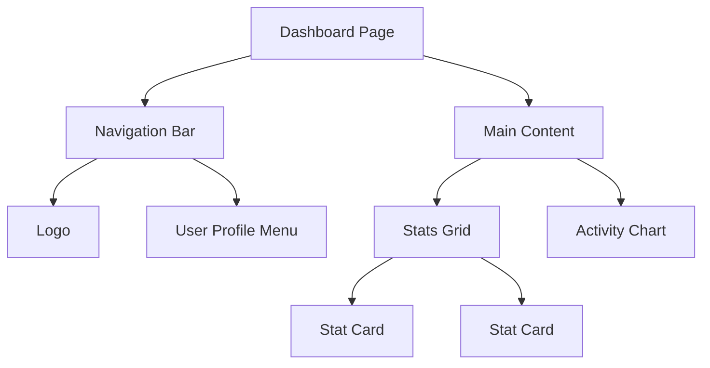

Welcome to 30 Days of React UI Mastery! Over the next month, we aren't just going to learn how React works—we are going to learn how to build user interfaces that look and feel incredibly premium.

## The Concept

Before we write a single line of React code, we need to understand how modern designers and frontend engineers look at a web page. When a beginner looks at a beautiful website, they see a single cohesive image. When an expert looks at the exact same website, they see a tree of isolated, reusable **components**.

<Analogy>
Think of building a UI like playing with Lego blocks. You don't try to mold an entire spaceship out of one giant piece of plastic. You build smaller, individual pieces—a wing, an engine, a cockpit—and then snap them together. In React, those pieces are components.
</Analogy>

## Why Component-Driven Design?

React forces you to think in components. This isn't just a technical requirement; it's a massive advantage for how you build products.

1. **Reusability**: Build a polished `<Button>` once, and use it across 50 different pages.
2. **Maintainability**: If the designer changes the button's background color, you only update it in one file, not 50.
3. **Separation of Concerns**: Your complex dashboard is just a collection of simple pieces (a header, a sidebar, a chart) working independently.

## Breaking Down a Design

Let's look at how we break down a typical user interface.

Notice how `Stat Card` is duplicated? That's the power of components. You design one card, and pass different `props` (data) to it to render it multiple times.

<Mistake>
A common mistake beginners make is putting hundreds of lines of JSX inside a single file (like `App.js`). If your file is over 200 lines long, you are likely missing an opportunity to extract smaller components!
</Mistake>

## The "Wow" Factor

Functionality is the baseline. But what makes a user interface truly stand out? Over the next 30 days, we'll dive into:
- **Tailwind CSS**: For rapid, beautiful styling without leaving your markup.
- **Micro-interactions**: Adding subtle hover states and click effects.
- **Framer Motion**: Introducing fluid, organic animations that make your app feel alive.

<VSCard
  left="Functional UI"
  right="Premium UI"
  leftDesc="Buttons click, forms submit, data loads. It works, but it feels rigid and generic."
  rightDesc="Transitions are smooth, colors are harmonious, layouts are responsive, and the app feels 'alive'."
/>

## Putting It Together

Start training your brain to see the web differently. Next time you visit your favorite app, try to visually draw boxes around the distinct components. Identify what parts are reused.

Tomorrow, we'll set up our environment and build our very first premium component using React and Tailwind CSS.

<Recap items={[
  "Stop seeing pages; start seeing trees of reusable components.",
  "Components provide reusability, maintainability, and separation of concerns.",
  "Break down complex UIs into small, isolated pieces before coding.",
  "A premium UI relies on styling, micro-interactions, and fluid animation."
]} />

<Trivia>
React was originally created by Jordan Walke, a software engineer at Facebook. He was heavily influenced by XHP, an HTML component framework for PHP, bringing the component-driven paradigm to the front-end!
</Trivia>
