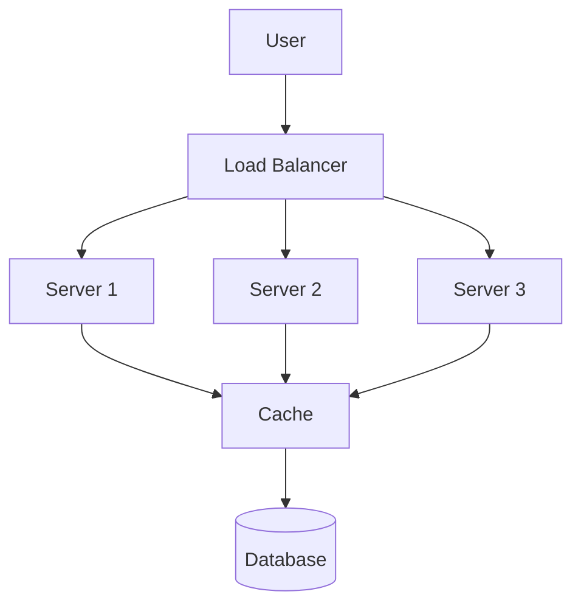

---
title: "Understand the Big Picture"
day: 1
topic: "Why System Design Exists"
--- 

Before you draw a single diagram, you need to understand *why* system design exists   and why every engineer eventually has to care about it.

## The Concept

System design is the practice of deciding how the different parts of an application   servers, databases, caches, load balancers   work together to handle real users, real traffic, and real failures.

Every app you use was designed by someone making these decisions. Instagram, Swiggy, Google Maps   all of them run on systems that someone deliberately architected to handle millions of people at once.

The reason this matters isn't academic. A system that works perfectly for 100 users can completely collapse at 1 million users if nobody thought about scale, failure, or speed in advance.

<Analogy>
Think of a small bakery that makes 50 loaves of bread a day in one oven. It works great. Now imagine demand suddenly jumps to 50,000 loaves a day. One oven, one baker, one delivery van   none of it works anymore. System design is the process of figuring out, in advance, how the bakery scales: more ovens, more bakers, a distribution network, backup ovens when one breaks down.
</Analogy>

## The Anatomy of Every System

Strip away the complexity, and almost every system follows the same basic skeleton:

  The **user** sends a request (opens an app, clicks a button)
  A **load balancer** decides which server handles it
  **Servers** run your application logic
  A **cache** stores frequently accessed data for speed
  A **database** stores everything permanently

Every system you'll study in this series is some variation of this skeleton, with extra pieces added as needs grow.

## Why Does System Design Exist?

There are four forces that make system design necessary. None of them are optional   every growing application runs into all four.

### Apps scale up

A system fine for 100 users will collapse at 1 million users without deliberate design. Traffic doesn't grow politely   it spikes during sales, viral moments, or breaking news, often 10x or 100x overnight.

### Failures always happen

Servers crash. Networks drop packets. Hard drives fail. This isn't a hypothetical   at scale, *something* is always failing somewhere. Good design assumes failure is constant and builds systems that keep working anyway.

### Speed is user experience

Every 100ms of extra latency measurably costs you users   people abandon slow apps. Where your data physically lives, and how far it has to travel to reach a user, directly determines how "fast" your app feels.

### Cost is real

Cloud infrastructure isn't free. A badly designed system might work, but cost 10x more to run than it needs to. Good design serves the same traffic for a fraction of the price.

## The Four Core Properties

When you design a system, you're really making decisions across four properties:

1. **Scalability**   can the system handle 10x the load tomorrow? This is the difference between *vertical scaling* (a bigger machine) and *horizontal scaling* (more machines)   something we'll dig into on Day 2.

2. **Reliability**   does the system keep working when one part fails? This is achieved through redundancy: if you have three servers and one crashes, the other two keep serving traffic.

3. **Latency**   how fast does the system respond? Techniques like caching and CDNs (content delivery networks) bring data physically closer to users.

4. **Trade offs**   every choice you make gives you something and costs you something. There is no perfect system, only systems that made deliberate trade offs for their specific needs.

That fourth one   trade offs   is the one beginners underestimate the most.

## The Trade off Mindset

Here's the mental shift that separates someone who's memorized definitions from someone who can actually design systems: **there are no universally "correct" answers, only answers that are correct for a specific set of constraints.**

<VSCard
  left="Consistency"
  right="Availability"
  leftDesc="Every read returns the latest data. Can be slower or temporarily unavailable during issues."
  rightDesc="The system always responds, even if the data returned is occasionally a few seconds stale."
/>

<VSCard
  left="SQL Database"
  right="NoSQL Database"
  leftDesc="Strong structure and guarantees. Excellent for relational data. Harder to scale horizontally."
  rightDesc="Flexible schema, scales out easily across many servers. Weaker consistency guarantees."
/>

<VSCard
  left="Monolith"
  right="Microservices"
  leftDesc="Simple to build, test, and deploy as one unit. Hard to scale just one feature independently."
  rightDesc="Each service scales and deploys independently. Significantly more operational complexity."
/>

Neither side of any of these is "better." A small startup with 3 engineers almost certainly should NOT build microservices   the operational overhead would crush them. A company running thousands of services with hundreds of teams almost certainly needs them.

<Mistake>
A very common beginner mistake is treating system design like a quiz with right and wrong answers   "always use microservices," "NoSQL is always better for scale," "always add a cache." In reality, an interviewer or a senior engineer cares far more about *whether you can explain the trade off* than which option you picked.
</Mistake>

## Putting It Together

System design isn't about memorizing a list of technologies. It's a way of thinking: given these constraints (number of users, budget, team size, latency requirements), what are the trade offs of each approach, and which trade offs are acceptable here?

Over the next 29 days, you'll build up the vocabulary and mental models to reason through these trade offs confidently   starting tomorrow with the most fundamental one of all: how do you even make a system bigger?

<Recap items={[
  "System design is the practice of deciding how parts of an app work together at scale",
  "Every system shares the same basic skeleton: User → Load Balancer → Servers → Cache → Database",
  "Four forces drive system design: apps scale up, failures happen, speed is UX, and cost is real",
  "Four core properties to design for: scalability, reliability, latency, and trade offs",
  "There are no universally correct answers   only trade offs that fit specific constraints"
]} />

<Trivia>
The term "five nines" (99.999% uptime) is a famous reliability target in system design   it allows for only about 5 minutes of downtime per year. Achieving it requires redundancy at every single layer of a system, which is why it's reserved for the most critical infrastructure, like emergency services and financial systems.
</Trivia>
