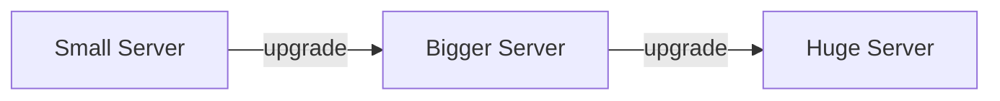
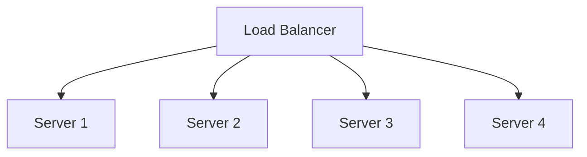

Your app is growing. More users, more requests, more load. There are exactly two fundamental ways to handle this   and almost every scaling decision you'll ever make is some variation of these two.

## The Concept

When a single server starts struggling under load, you have two options: make that server bigger, or add more servers alongside it. These are called **vertical scaling** and **horizontal scaling**, and the difference between them shapes almost every architectural decision that follows.

Get this concept right, and concepts like load balancers, database replication, and stateless design (which we'll cover in the coming days) will all click into place faster   because they all exist to support one of these two strategies.

<Analogy>
Imagine a coffee shop with one barista who's getting overwhelmed by the morning rush. You have two options: give that barista a faster espresso machine and more counter space so they can work quicker (vertical scaling)   or hire two more baristas and open more stations (horizontal scaling). Both solve the "too many customers" problem, but they create very different shops.
</Analogy>

## Vertical Scaling   Scale Up

Vertical scaling means making your existing machine more powerful   more CPU, more RAM, faster storage (often called "scaling up").

**What it looks like:**

One machine, growing in capacity over time. Same architecture, just a more powerful box.

**Why it's attractive:**

- **Simple**   no code changes needed, no distributed systems complexity
- **No coordination problems**   there's only one machine, so there's nothing to keep "in sync"
- **Great for databases**   many databases are easier to run as a single powerful instance than as a distributed cluster

**The catch:**

There's a hard ceiling. The most powerful server you can rent or buy is still finite. Once you're maxed out, vertical scaling is no longer an option   and upgrading often requires downtime, since you typically need to restart the machine.

## Horizontal Scaling   Scale Out

Horizontal scaling means adding more machines and spreading the load across them (often called "scaling out").

**What it looks like:**

Instead of one big machine, you have many smaller ones, and a load balancer distributes incoming requests between them.

**Why it's attractive:**

- **Near-unlimited scale**   need more capacity? Add another server
- **Fault tolerant**   if one server crashes, the others keep serving traffic
- **Cost-efficient at scale**   many smaller machines are often cheaper than one giant one

**The catch:**

This requires your application to be **stateless**   meaning any server can handle any request, because no server is holding onto user-specific data in memory. If your app stores session data locally on one server, horizontal scaling breaks, because a user's second request might land on a different server that has no idea who they are.

This is also where the "distributed systems tax" kicks in: more moving parts means more complexity in deployment, monitoring, and debugging.

## When to Use Which

<VSCard
  left="Vertical Scaling"
  right="Horizontal Scaling"
  leftDesc="Stateful apps (databases), early-stage products, need a quick fix, want to avoid distributed complexity."
  rightDesc="Expect massive growth, need high availability, stateless apps, willing to manage more complexity."
/>

A useful rule of thumb: **vertical scaling buys you time, horizontal scaling buys you ceiling.** Early-stage startups often scale vertically first because it's simple and fast. As they grow and reliability becomes critical, they shift toward horizontal scaling for the parts of the system that need it most.

<Mistake>
A common mistake is assuming horizontal scaling is always "better" because it's what big tech companies do. For a small app with a single database, converting everything to a horizontally-scaled, stateless, multi-server architecture on day one adds enormous complexity for a problem you don't have yet. Scale when you actually hit the ceiling   not before.
</Mistake>

## The Limits of Both

Neither approach scales "forever"   each has a real limit.

**Vertical scaling's limit** is physical: there's a maximum amount of CPU, RAM, and storage that can exist in one machine. Beyond that, no amount of money buys you a bigger box.

**Horizontal scaling's limit** is complexity: every additional server adds coordination overhead. Load balancing, network latency between servers, and keeping shared data consistent all become harder as the number of servers grows. At extreme scale, this complexity itself becomes the bottleneck.

## The Golden Rule   Most Systems Do Both

In practice, almost every real-world system uses a mix of both strategies, applied to different parts of the architecture.

A typical setup:

- **Application servers** scale horizontally   stateless servers behind a load balancer, scaling out as traffic grows
- **Primary database** scales vertically at first   one powerful database server is simpler to manage
- **As the database itself becomes a bottleneck**, it then scales horizontally too   through techniques like read replicas and sharding (topics for later days)

This layered approach is why system design interviews rarely have a single "correct" architecture. The right answer depends on which part of the system you're scaling, and at what stage of growth.

## Putting It Together

The decision between vertical and horizontal scaling isn't a one-time choice   it's a recurring question you'll ask about *every* component of a system: this database, this caching layer, this background job processor. Some parts will scale up, some will scale out, and many will eventually do both.

Tomorrow, we look at the piece of infrastructure that makes horizontal scaling actually work in practice: the **load balancer**   the traffic director that decides which server gets which request.

<Recap items={[
  "Vertical scaling = making one machine bigger (scale up)",
  "Horizontal scaling = adding more machines (scale out)",
  "Vertical scaling is simple but has a hard hardware ceiling",
  "Horizontal scaling is nearly unlimited but requires stateless design and adds complexity",
  "Most real systems combine both   scaling different components differently as they grow"
]} />

<Trivia>
Stack Overflow famously ran its entire platform   serving tens of millions of monthly visitors   on a surprisingly small number of vertically-scaled servers for years, long after many assumed they'd need a massive horizontally-scaled fleet. It's a great real-world reminder that vertical scaling can take you much further than people expect.
</Trivia>
