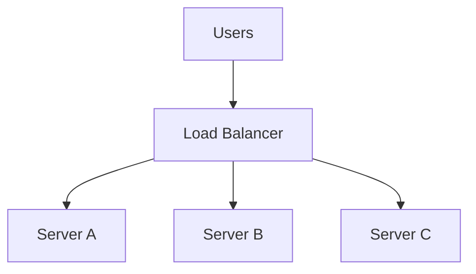

When you scale horizontally and add more servers, you create a new problem: how do you decide which server gets which request? This is where the load balancer comes in.

## The Problem with Multiple Servers

Yesterday we learned that horizontal scaling (adding more machines) is how systems handle massive growth. But if you have three servers, what happens when a user types your website address into their browser?

Without a load balancer, one server might get slammed with all the traffic while the others sit idle. Worse, if that one server crashes, all those users get an error, even though you have two perfectly good servers doing nothing.

<Analogy>
Imagine a busy bank with five tellers but no line manager. Customers just walk up to whichever teller they see first. One teller might have a huge line while another is completely free. A load balancer is the line manager standing at the front, directing the next customer to the least busy teller.
</Analogy>

## The Load Balancer Setup

A load balancer sits between your users and your servers. Users don't connect to your servers directly anymore; they connect to the load balancer, which then forwards their request to an available server.

This solves two massive problems:
1. **Capacity**: It spreads the work evenly so no single server gets overwhelmed.
2. **Reliability**: If Server B crashes, the load balancer stops sending traffic there and routes everyone to A and C.

## How It Decides: Routing Algorithms

How does the load balancer choose which server gets the next request? There are several algorithms, but these are the most common:

### Round Robin
The simplest approach. The load balancer goes down the line: request 1 goes to Server A, request 2 to Server B, request 3 to Server C, request 4 back to Server A. 
*Trade-off*: It's predictable and easy, but it assumes all servers are equally powerful and all requests take the same amount of time. If Server A gets stuck on a heavy database query, Round Robin will keep sending it more work anyway.

### Least Connections
The smarter approach. The load balancer keeps track of how many active requests each server is currently processing, and sends the new request to the server with the fewest active connections.

<VSCard
  left="Round Robin"
  right="Least Connections"
  leftDesc="Simple, predictable. Cycles through servers evenly   but ignores how busy each one actually is."
  rightDesc="Sends traffic to whichever server has the fewest active connections   smarter under uneven load."
/>

## How It Decides: Network Layers

Load balancers operate at different layers of the network.

- **Layer 4 (Transport)**: Routes traffic based only on IP address and port. It doesn't look inside the HTTP request. It's incredibly fast because it's just moving bytes, but it's "dumb".
- **Layer 7 (Application)**: Looks inside the HTTP request. It can see the URL, the headers, and the cookies. This means it can route requests to `/api/video` to specialized video servers, and `/api/text` to standard servers. It's "smarter" but slightly slower because it has to inspect the payload.

## Health Checks

A load balancer is only useful if it knows which servers are actually alive. It does this through **Health Checks**. Every few seconds, the load balancer pings a specific endpoint on each server (e.g., `/health`). If the server replies with a `200 OK`, it stays in rotation. If it times out or returns an error, the load balancer removes it from the pool until it becomes healthy again.

<Mistake>
A common beginner mistake is assuming that once you add a load balancer, your system is perfectly reliable. But what happens if the load balancer itself crashes? You've just created a new single point of failure!
</Mistake>

## The Load Balancer Can Fail Too

If all traffic flows through one load balancer, and that load balancer goes down, your whole system goes down. 

The solution? **Run more than one load balancer.**

In production systems at scale, you always run multiple load balancers in an "active-passive" or "active-active" setup. If the primary load balancer dies, DNS or a floating IP address automatically routes traffic to the backup load balancer.

As the quote from the Quick Read goes: *"The fix for a single point of failure is never zero points   it's more points."*

## Putting It Together

Load balancers are the glue that makes horizontal scaling possible. They abstract the complexity of multiple servers away from the user, providing a single entry point that manages capacity, routes around failures, and keeps your application highly available.

Tomorrow, we'll look at the next major bottleneck in a growing system, and how to fix it by making things feel instant: **Caching**.

<Recap items={[
  "One server = single point of failure",
  "Load balancers distribute traffic across servers",
  "Layer 4 routes by IP/port, Layer 7 reads the request",
  "Round Robin and Least Connections are common algorithms",
  "Health checks remove dead servers automatically",
  "Run two+ load balancers   never just one"
]} />

<Trivia>
Netflix runs much of its infrastructure on AWS, but they don't just use standard load balancing. They built their own incredibly sophisticated routing layer called Zuul, which can dynamically reroute millions of requests per second away from failing Amazon data centers before users even notice a blip.
</Trivia>
